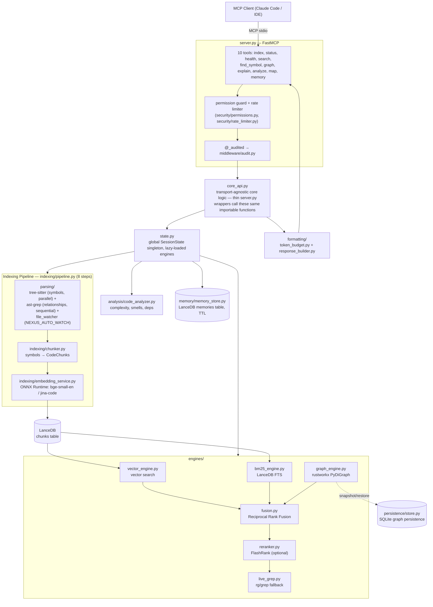

# Architecture

Nexus-MCP is a unified Model Context Protocol (MCP) server that combines vector search, full-text search, code graph analysis, and semantic memory into a single process. It is designed to run locally with <350MB RAM.

Nexus-MCP consolidates two predecessor projects into a single server ([ADR-001](adr/ADR-001-single-mcp-consolidation.md)):
- **CodeGrok MCP** (by rdondeti / Ravitez Dondeti, MIT license) — Contributed the symbol extraction pipeline, embedding service, parallel indexing, core data models, and memory retrieval system.
- **code-graph-mcp** (by [entrepeneur4lyf](https://github.com/entrepeneur4lyf)) — Contributed the ast-grep structural parser, rustworkx graph engine, code complexity analysis, and relationship extraction.

## System Overview

10 tools, consolidated from an earlier 15 ([ADR-017](adr/ADR-017-tool-consolidation.md)): `index`, `status`, `health`, `search`, `find_symbol`, `graph`, `explain`, `analyze`, `map`, `memory`.



## Key Components

### Core API Layer (`core_api.py`)

Transport-agnostic core logic. Every MCP tool in `server.py` is a thin wrapper: it applies the permission guard, rate limiter, and audit decorator, then calls a plain Python function in `core_api.py`. Any other process — including an in-process agent harness — can import `core_api` directly and call the same functions, with no subprocess, stdio, or MCP protocol overhead. `core_api.py` owns the module-level `_pipeline` reference and its lock.

### Indexing Pipeline (`indexing/pipeline.py`)

The 8-step pipeline transforms source code into searchable indexes:

1. **Discover** — Walk directory tree, filter by extension/size/.gitignore
2. **Parse symbols** — tree-sitter extracts functions, classes, methods (parallel)
3. **Parse graph** — ast-grep extracts functions, classes and import relationships as `CONTAINS`/`IMPORTS` edges (sequential). No parser creates `CALLS` or `INHERITS` edges yet.
4. **Transfer graph** — Populate rustworkx graph from ast-grep results
5. **Chunk** — Convert symbols to CodeChunks with deterministic IDs
6. **Embed** — generates vectors (384-dim bge-small-en default, PyTorch; 768-dim jina-code, ONNX Runtime)
7. **Store** — Write chunks to LanceDB, rebuild FTS index
8. **Cleanup** — Unload embedding model, save metadata for incremental reindex

Incremental reindexing uses mtime-based change detection: only new/modified files are re-processed. Corrupt indexes are auto-detected and rebuilt.

### Search Engines

**Vector Engine** (`engines/vector_engine.py`) — LanceDB-backed semantic search. Embeds queries at search time and performs flat cosine similarity search. Filters via SQL-escaped WHERE clauses.

**BM25 Engine** (`engines/bm25_engine.py`) — LanceDB's native Tantivy full-text search. Reads from the same `chunks` table. Good for exact keyword matches.

**Graph Engine** (`engines/graph_engine.py`) — rustworkx (Rust-backed) directed graph. Stores nodes (functions, classes) and edges. The engine supports `CALLS` traversal for callers, callees and transitive impact analysis. Real indexes hold only `CONTAINS` and `IMPORTS` edges today, so those traversals return empty results until a parser extracts call edges.

**Fusion** (`engines/fusion.py`) — Reciprocal Rank Fusion combines results from vector, BM25, and graph engines with configurable weights (default: 0.5/0.3/0.2).

**Reranker** (`engines/reranker.py`) — Optional FlashRank two-stage reranker. Gracefully degrades to passthrough if not installed.

**Live Grep** (`engines/live_grep.py`) — Fallback using ripgrep (`rg`), falling back to standard `grep` if `rg` isn't installed. Covers unindexed or newly created files, and is used automatically when hybrid results are sparse.

### Dual Parser Strategy

**tree-sitter** — Fast, incremental parser for 25+ languages. Extracts symbol definitions (functions, classes, methods) with metadata (line numbers, docstrings, signatures). Runs in parallel via ThreadPool.

**ast-grep** — Structural search tool that extracts the containment and import structure of each file (functions, classes, imports). Call and inheritance extraction is planned. Runs sequentially to build a consistent graph.

tree-sitter also records the call names inside each symbol. The chunker writes them into the chunk text (`Calls: ...`), so they help search. They do not become graph edges yet.

### Memory Store (`memory/memory_store.py`)

LanceDB-backed semantic memory with 11-column PyArrow schema. Supports:
- TTL-based expiration (permanent, month, week, day, session)
- Tag-based filtering with LIKE wildcards
- Memory types: note, decision, conversation, status, preference, doc

### State Management

`state.py` holds a global singleton `SessionState` with references to all engines. Lazy-loaded: engines are `None` until `index` is called. Thread-safe shutdown with lock-protected `shutdown()` method that persists graph state.

### Persistence

- **LanceDB** — Disk-backed vectors and FTS via mmap (~20-50MB overhead)
- **SQLite** (`persistence/store.py`) — Graph persistence for warm-start recovery
- **JSON metadata** — File mtimes for incremental reindex detection

### Auto-Watch and Staleness ([ADR-015](adr/ADR-015-auto-watch-and-staleness-detection.md))

After `index()` finishes, `core_api._ensure_file_watcher` starts a debounced watchdog (`parsing/file_watcher.py`) for each indexed root (`NEXUS_AUTO_WATCH`, default on). A change triggers a background incremental reindex on a daemon thread. `status()` and `search()` also run a throttled mtime check (`NEXUS_STALENESS_CHECK_INTERVAL`, default 15 s). If files changed, the result carries `stale`/`staleness_warning` (or `warning`), the call still returns at once, and a background reindex starts.

### Security ([ADR-012](adr/ADR-012-tool-permission-model.md), [ADR-014](adr/ADR-014-rate-limiting.md))

- **Permissions** — `security/permissions.py` maps each tool to READ, MUTATE or WRITE. `NEXUS_PERMISSION_LEVEL=read` allows READ tools only. `memory` is action-aware: `search` is READ, `store` and `delete` are WRITE.
- **Rate limiting** — `security/rate_limiter.py` is a per-tool token bucket. It is off by default (`NEXUS_RATE_LIMIT_ENABLED`).
- **Audit** — `middleware/audit.py` logs each call with a correlation ID and redacts sensitive fields (`NEXUS_AUDIT_ENABLED`, default on).

## Data Flow

### Indexing
```
Source files → tree-sitter → Symbols → Chunker → CodeChunks
                                                      ↓
Source files → ast-grep → UniversalGraph → rustworkx   ONNX embed
                                                      ↓
                                              LanceDB (chunks table)
```

### Hybrid Search
```
Query → embed → Vector search (LanceDB)  ─┐
Query →       → BM25 search (Tantivy)     ├→ RRF Fusion → FlashRank → Live Grep (fallback) → Results
Query →       → Graph relevance search    ─┘
```

## Memory Budget

Target: <350MB RSS. Achieved through:
- ONNX Runtime (~50MB) for jina-code instead of PyTorch (~500MB); the bge-small-en default uses PyTorch
- LanceDB mmap (vectors stay on disk, ~20-50MB overhead)
- Lazy model loading — embedding model loaded during indexing, unloaded after
- GPU/MPS auto-detection (`NEXUS_EMBEDDING_DEVICE=auto`) for faster inference when available
- Two model options: bge-small-en (384d, default), jina-code (768d)

## Thread Safety

- Vector engine: RLock for write operations, concurrent reads allowed
- Graph engine: RLock for all mutations
- Pipeline: `core_api._pipeline_lock` is held for the whole of `index()`. A background reindex does a non-blocking acquire and skips when the pipeline is busy
- State shutdown: Lock-protected to prevent double-shutdown on signal + finally

## Configuration

All settings are in `config.py` with NEXUS_ env prefix. See README for the full table.
